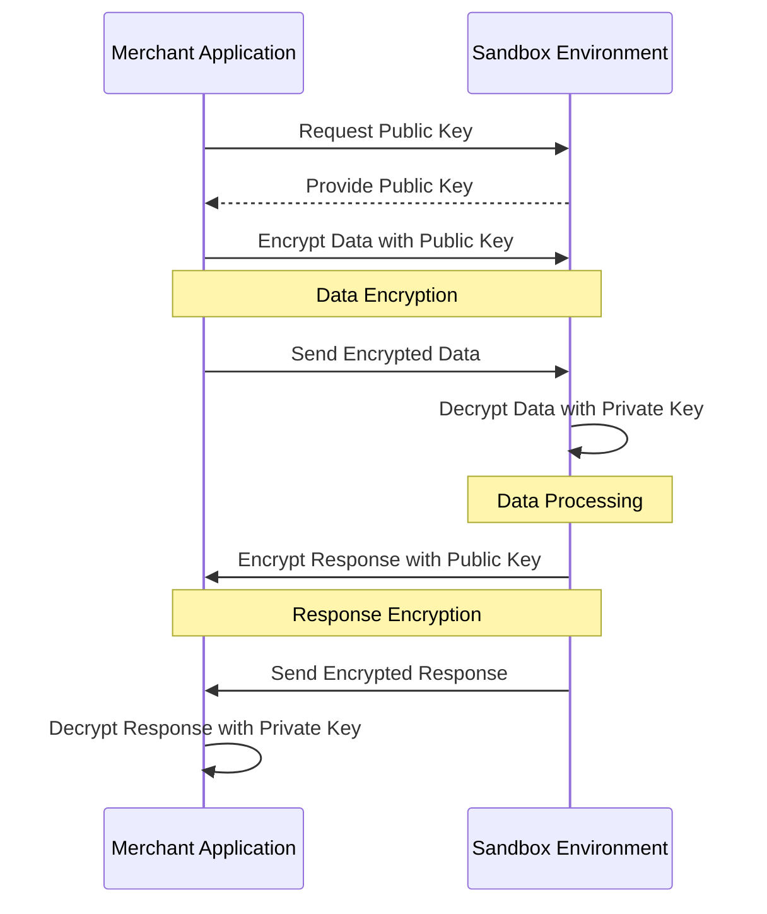
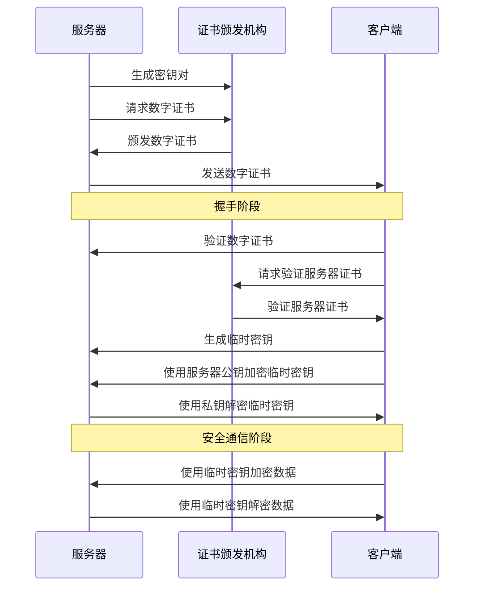

"# SC" 

**加密和安全验证**

_1.公钥 _

> 初始状态是，1.用户自己生成一对公私人钥，自己留私钥，公钥给商户，同理商户也是自己生成一对公私人钥，自己留私钥，公钥给用户
>
> 2.获取方式，一般在商家的平台应用那里手动获取，不经过网络获取，不安全

1. **公钥/证书生成：** 沙箱环境会生成一对密钥，包括公钥和私钥。公钥是用于加密数据的，而私钥是用于解密数据的，并且只有沙箱环境知道私钥。
2. **商户应用获取公钥：** 商户应用需要获取沙箱环境的公钥，通常是通过一种安全的方式（例如下载证书或从沙箱环境的信任源获取）来获得沙箱环境的公钥。
3. **加密数据：** 当商户应用需要向沙箱环境发送敏感信息（例如支付请求）时，它将使用沙箱环境提供的公钥对数据进行加密。这通常涉及到使用 RSA2 算法对数据进行加密，以确保数据的机密性。
4. **数据传输：** 商户应用将加密后的数据发送到沙箱环境，这可以通过安全的通信渠道（如 HTTPS）来完成。由于数据已经使用沙箱环境的公钥加密，只有沙箱环境的私钥才能解密它。
5. **沙箱环境解密数据：** 沙箱环境收到商户应用发送的加密数据后，使用自己的私钥进行解密。只有沙箱环境拥有私钥，因此只有它能够成功解密数据。
6. **数据处理：** 解密后的数据在沙箱环境中进行处理，例如验证支付请求的有效性，然后生成响应。
7. **响应加密：** 沙箱环境使用商户应用提供的公钥对响应数据进行加密，以确保响应在传输过程中的安全性。
8. **商户应用解密响应：** 商户应用收到响应后，使用自己持有的私钥进行解密，以获取沙箱环境返回的数据。

通过这个公钥/证书机制，商户应用与沙箱环境之间的通信得到了保护。商户应用使用沙箱环境的公钥加密数据，只有沙箱环境拥有私钥可以解密。反之，沙箱环境也可以使用商户应用的公钥加密响应数据，确保只有商户应用能够解密。这种方式可以有效地保障交互数据的机密性和安全性。

_2.证书 _

> 有三个人 用户，服务器 和 CA 记得区分
>
> 状态: 在SSL/TLS通信中，服务器的私钥确实是服务器自己生成的，并且它是用于加密和解密通信的关键。服务器的私钥通常不会从 CA 那里获取，而是由服务器生成和管理。客户端(预先获取或者内置公钥)和服务器共同有一个对称密钥，用来加密和解密内容（非对称技术(公钥私钥)来传递对称的密钥  +  对称技术的加密和解密）

1. 服务器生成一对密钥，包括公钥和私钥。私钥将一直保存在服务器上，并且非常保密。
2. 服务器向 CA 请求数字证书，CA 将服务器的公钥和相关信息包含在证书中，并使用 CA 的私钥对证书进行签名。这个签名可以验证证书的真实性。
3. 服务器将自己的数字证书发送给客户端。
4. 客户端验证服务器的数字证书：
   - 客户端使用内置的或预先获取的 CA 的公钥来验证服务器的数字证书的签名。
   - 客户端检查证书中的有效期和其他信息，以确保证书是有效的。
   - 如果验证成功，客户端信任服务器，并可以继续通信。
5. 客户端生成一个临时密钥，用服务器的公钥加密它，并将其发送给服务器。这个过程确保了通信的机密性。
6. 服务器使用自己的私钥来解密客户端发送的临时密钥，然后双方使用共享的临时密钥进行通信。

证书的有效性检查通常由客户端（例如，Web浏览器）执行，而不是服务器。以下是验证过程的概述：

1. **客户端验证：** 当客户端（如Web浏览器）尝试与服务器建立安全连接时，它会收到服务器的数字证书。
2. **客户端检查证书有效性：** 客户端会检查证书的有效性，包括以下方面：
   - **有效期：** 客户端检查证书的有效期，确保证书在当前时间内仍然有效。
   - **域名匹配：** 如果证书包含了域名信息，客户端会检查证书中的域名是否与正在连接的服务器域名匹配。这是为了防止中间人攻击。
   - **吊销状态检查：** 客户端可以使用证书吊销列表（CRL）或在线证书状态协议（OCSP）来查询 CA 是否已吊销该证书。
   - **证书链验证：** 客户端验证证书的完整性，确保证书链中的每个证书都是受信任的。
3. **客户端信任 CA：** 客户端需要信任颁发证书的 CA。客户端操作系统或浏览器通常内置了一组受信任的根证书颁发机构（CA）。如果服务器的证书链中的根证书由客户端信任的 CA 签发，那么客户端将信任该证书。
4. **安全连接建立：** 如果客户端成功验证了服务器的数字证书，它将继续建立安全连接，使用证书中的公钥来加密通信。

总结来说，客户端是负责验证服务器的数字证书有效性的一方。客户端会检查证书的各种属性，确保其真实性、有效期和受信任的颁发机构。如果验证失败，客户端通常会警告用户或拒绝建立连接，以确保通信的安全性。服务器通常不直接验证客户端的数字证书，因为客户端验证主要用于确认服务器的身份。

>  我想知道的是，https协议，有证书，才能自动开启吗？谁发出的，关注点在于底层原理，http怎么转变成https，请详细说一下这个过程

HTTPS 协议与 HTTP 协议的主要区别在于安全性，它使用了加密技术来保护数据传输的机密性和完整性。以下是 HTTP 如何转变为 HTTPS 的详细过程：

1. **证书的获取与安装：** 要启用 HTTPS，服务器管理员首先需要获取数字证书，通常从受信任的证书颁发机构（CA）处购买或获取免费证书。这个证书包括了服务器的公钥以及一些与服务器相关的信息。一旦获得证书，服务器管理员需要将其安装在服务器上。
2. **配置服务器：** 服务器管理员需要配置服务器软件（例如，Apache、Nginx、Tomcat等）以启用 HTTPS。配置涉及以下几个关键步骤：
   - 指定服务器的私钥文件，以便服务器可以使用它来解密传入的数据。
   - 指定服务器的证书文件，以便向客户端提供公钥和其他证书信息。
   - 配置服务器以监听 HTTPS 请求的默认端口（通常是443）。
   - 配置其他安全参数，如密码套件和协议版本。
3. **客户端请求：** 当客户端（例如，Web浏览器）尝试访问服务器上的网站时，它会发送一个 HTTPS 请求。这是通过在 URL 中使用 "https://" 前缀来指示的。
4. **服务器握手：** 一旦服务器收到 HTTPS 请求，它会与客户端进行握手过程。这包括以下步骤：
   - 服务器将其证书发送给客户端。
   - 客户端验证证书的有效性。这包括检查证书是否已过期，是否与服务器域名匹配以及是否由受信任的 CA 签发。
   - 客户端生成一个随机的临时密钥，并使用服务器的公钥加密它，然后将其发送回服务器。
5. **数据加密：** 一旦握手成功，服务器使用其私钥解密客户端发送的临时密钥，并使用该临时密钥与客户端共享加密密钥。从现在开始，所有数据在传输过程中都会使用这个共享的加密密钥进行加密和解密。
6. **安全通信：** 一旦加密密钥共享完成，服务器和客户端之间的通信就会变得安全。所有传输的数据都会以加密形式进行传输，从而保护机密性和完整性。

总结来说，HTTP 转变为 HTTPS 的过程涉及获取和安装数字证书，配置服务器以支持 HTTPS，然后进行握手并建立加密通信。HTTPS 协议的主要优势在于它提供了安全的数据传输，防止了数据的窃听和篡改。证书颁发机构（CA）在此过程中起着关键作用，它们验证服务器的身份并签发证书，以增加可信度。

> 客户端(浏览)与服务器握手 和数据加密，都是浏览器帮完成的是吗？前端开发人员不用处理握手和数据加密是吗？
>
> (分清权限和职责)

是的，客户端（通常是浏览器）与服务器之间的握手和数据加密是由浏览器自动处理的，前端开发人员无需手动处理这些细节。HTTPS 协议的加密和握手过程是由浏览器内置的功能和安全库来管理的，这些功能会在建立安全连接时自动执行。

前端开发人员主要的关注点在于开发网站的内容和用户界面，以确保网站在用户端的可用性和用户体验。HTTPS 提供了一种安全的通信方式，使得数据在传输过程中更加安全，但这个安全性是由浏览器和服务器之间的协议和加密来实现的，不需要前端开发人员手动干预。

前端开发人员可以确保网站在使用 HTTPS 协议时正常工作，可以使用相对链接（相对于站点根目录）来引用资源，以避免在 HTTPS 网站上引起混合内容问题。此外，他们可以确保网站的内容和代码没有安全漏洞，以提高网站的整体安全性。

总的来说，HTTPS 协议的实现和维护主要由服务器管理员和浏览器厂商负责，前端开发人员的主要任务是确保网站内容的可用性和安全性。

>  客户端验证服务器的数字证书： 客户端使用内置的或预先获取的 CA 的公钥来验证服务器的数字证书的签名。 那如果客户端没有内置的公钥，如何预先获取

如果客户端没有内置的 CA 公钥，通常有以下几种方式来获取 CA 的公钥：

1. **操作系统和浏览器内置的 CA 列表：** 大多数操作系统和主流的浏览器内置了一组受信任的 CA 公钥。这些 CA 通常是全球范围内受信任的证书颁发机构，如VeriSign、DigiCert、GlobalSign等。因此，当客户端首次使用操作系统或浏览器访问 HTTPS 网站时，它们可以使用内置的 CA 公钥来验证服务器的数字证书。这通常是默认配置，无需用户干预。
2. **CA 证书下载：** 一些 CA 机构会提供其公钥的下载页面。用户可以访问这些页面并下载 CA 的根证书，然后手动将其添加到浏览器或操作系统的受信任 CA 列表中。这个过程可以根据不同的操作系统和浏览器而有所不同。
3. **软件开发包：** 一些软件开发包和框架（如 Java 和 OpenSSL）通常包含了默认的 CA 列表，这些 CA 列表可以在开发应用程序时使用。开发人员可以利用这些软件开发包来确保他们的应用程序可以验证服务器的数字证书。
4. **自签名证书：** 有些组织使用自签名证书来加密通信，而不是受信任的 CA。在这种情况下，客户端需要获得自签名证书的公钥，并手动添加到受信任的 CA 列表中。

需要注意的是，自签名证书的使用相对不太安全，因为它们没有受到独立的第三方 CA 的验证。在生产环境中，通常建议使用受信任的 CA 颁发的证书，以确保通信的安全性和可信度。

总之，客户端可以通过多种方式获取 CA 的公钥，以进行数字证书的验证。这些方法通常是配置在操作系统、浏览器或开发环境中的，并且可能需要一些手动操作或配置。

>  数字证书的验证  主要是验证CA的签名是吗？  那服务器要传过来一个公钥？

是的，数字证书的验证主要涉及两个方面：

1. **验证 CA 的签名：** 客户端使用内置的或预先获取的 CA 的公钥来验证服务器的数字证书的签名。验证的过程包括确保证书的签名有效，并且该证书由受信任的 CA 签发。这一步骤确保了证书的真实性和可信度。
2. **获取服务器的公钥：** 服务器的数字证书中包含了服务器的公钥。一旦证书验证通过，客户端就会从证书中提取服务器的公钥，然后使用该公钥来建立安全通信。这个公钥将用于加密和解密数据，确保数据的机密性。

总的来说，服务器在数字证书中附带了自己的公钥，并且该证书由受信任的 CA 签发。客户端首先验证证书的签名以确保证书的真实性，然后提取服务器的公钥并使用它来建立安全通信。这个过程确保了通信的安全性和可信度。

> 安全连接建立：** 如果客户端成功验证了服务器的数字证书，它将继续建立安全连接，使用证书中的公钥来加密通信。，我想知道的是，每次连接，都要验证服务器的数字证书嘛？看有效期

是的，每次建立连接时，客户端通常都会验证服务器的数字证书。验证包括检查证书的有效期、是否与服务器的域名匹配以及是否由受信任的证书颁发机构（CA）签发。这种验证确保了每次通信都是安全和可信任的。

验证数字证书的有效期是非常重要的，因为证书通常有一个固定的有效期，通常为一年或更长。一旦证书过期，客户端通常会拒绝建立连接，因为过期的证书可能不再具备安全性和可信度。

因此，验证服务器的数字证书是建立安全连接的关键步骤之一，而且它通常在每次连接时都会执行，以确保通信的持续安全性。如果证书验证失败（例如，证书过期或与域名不匹配），客户端通常会发出警告或拒绝连接，以保护通信的安全性。
